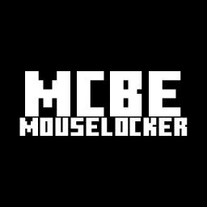

<h1>MCBEMouseLocker</h1>

    

A tool to resolve the mouse problem of Minecraft for Windows (Bedrock Edition)
<i>Notice that: this program is in the development stage</i>

## Feature
- Lock the cursor to the center of the window.
- Lite & Low memory footprint.
- suitable for **BOTH** *full screen mode* and *windowed mode*

## License & Copyright
All the project is based on GNU GPLv3.
Copyright © 2023 orbitgw <orbitgw@foxmail.com>